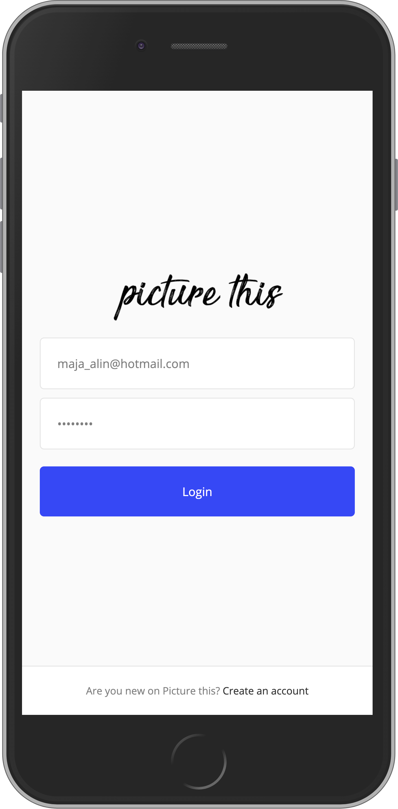
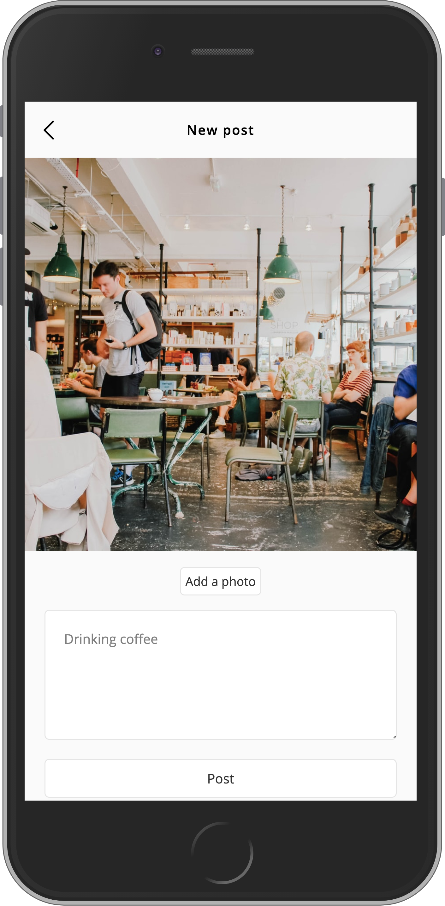
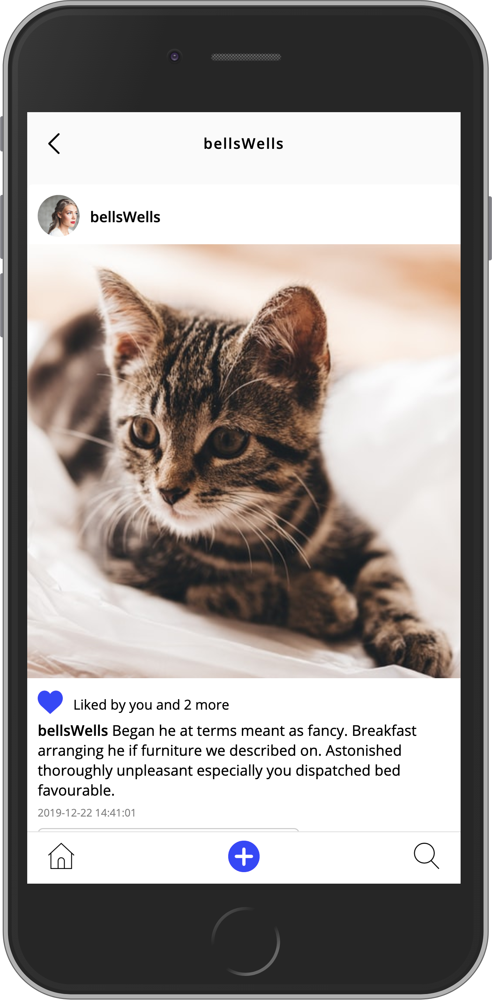
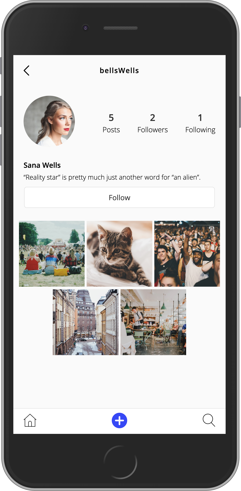

# Picture-This

<p align="center">
  
   
  
  
</p>


## Assignments

The assignment is to create an Instagram clone with CSS, HTML, Javascript and PHP.

- As a user you should be able to create an account
- As a user you should be able to login
- As a user you should be able to logout
- As a user you should be able to edit your account email, password and biography
- As a user you should be able to upload a profile avatar image
- As a user you should be able to create new posts with image and description
- As a user you should be able to edit your posts
- As a user you should be able to delete your posts
- As a user you should be able to like posts
- As a user you should be able to remove likes from posts
- As a user you should be able to follow and unfollow other users
- As a user you should be able to view a list of posts by users you follow

Extra features added by [Michaela Lundborg](https://github.com/lundborgm)
- As a user you should be able to add, edit, delete comments on posts
- As a user you should be able to delete my account along with all posts and comments

## Installation
1. Clone down the project to your computer

    ```
    $ git clone https://github.com/majaalin/picture-this.git
     ```
2. Star your server

3. Open the index.html file in your browser

## Testers
- Julia Karlsson
- Victor Ljungblad

## Code Reviews
From [Bernhard Stedt](https://github.com/Vehx)
- Very good variable names, makes it super easy to understand what is going on in the code.

- [search-results.php:L-35](https://github.com/majaalin/picture-this/blob/25d21ac8971e60e69f0c9bc34175d03e249e8509/app/users/search-results.php#L35) Adding a redirect at the end of the file would be nice incase something goes wrong and someone ends up "stuck" on this page.

- [main.js:L-10](https://github.com/majaalin/picture-this/blob/25d21ac8971e60e69f0c9bc34175d03e249e8509/assets/scripts/main.js#L10) On pages without the top-nav this line complains it can't find anything in console. Adding an if statement to check that it isn't undefined might fix this.

- [search.css:L-37-38](https://github.com/majaalin/picture-this/blob/25d21ac8971e60e69f0c9bc34175d03e249e8509/assets/styles/search.css#L37-L38) Theres an empty mediaquery here. Otherwise the css files are awesome, small and easy to find everything.

- [edit-post.php:L-45](https://github.com/majaalin/picture-this/blob/25d21ac8971e60e69f0c9bc34175d03e249e8509/app/posts/edit-post.php#L45) This is great for developing, but for a site in active use an error message without die would be better.

- [edit-profile:L-16-18](https://github.com/majaalin/picture-this/blob/25d21ac8971e60e69f0c9bc34175d03e249e8509/app/users/edit-profile.php#L16-L18) Super neat way of getting the user.

- [password.php:L-41](https://github.com/majaalin/picture-this/blob/25d21ac8971e60e69f0c9bc34175d03e249e8509/app/users/password.php#L41) confirmNewPassword is hashed but never used afterwards.

- There are a couple places where you repeat the same code, maybe make a function for easy reuse.

- The comments in your are great and helps other developers know what is happening where.

- Overall awesome code and the site looks great!


## License
This project is licensed under the MIT License - see the [LICENSE](LICENSE) file for details
